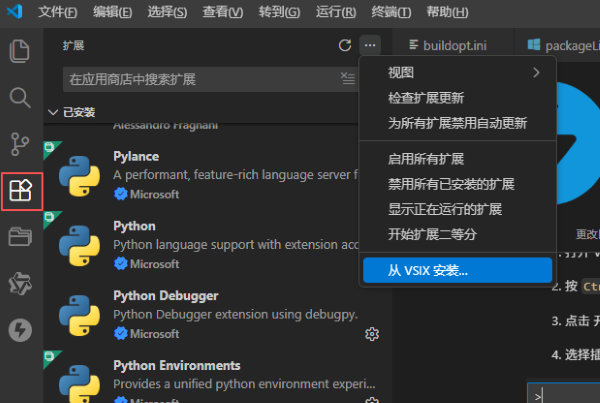
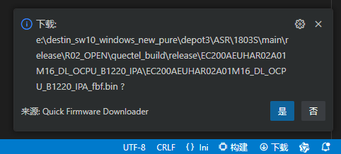
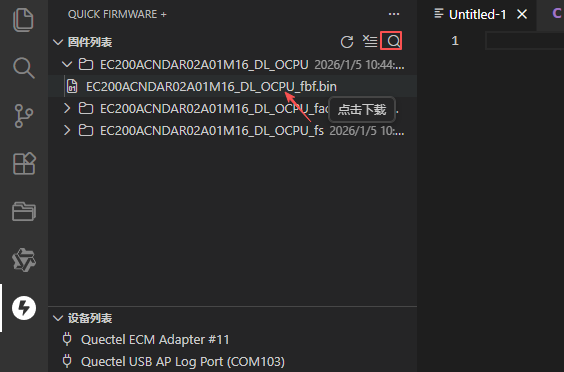

# Quick Firmware +

⚡协助编译生成的固件和快速固件下载的插件⚡

目前支持芯片平台(RTOS):

- 🧩`ASR`     160X | 1802S | 1803S | 1903S 

- 🧩`UNISOC`  8310 | 8910 | 8850*

- 🧩`EIGEN`   618* | 718*

不同平台镜像文件类型差异见下表：

| 🧩平台     |   🟧芯片型号    |  🟦镜像类型 |  🟩底层工具 | 
|------------|-----------------|-------------|-------------|
|  ASR       | 160X            | `*.zip`     | aboot       | 
|  ASR       | 1803 1903 1802  | `._fbf.bin` | FBF         | 
| UNISOC     | 8310 8910 8850  | `*.pac`     | Research    | 
| Eigen      | 618 718         | `*.binpkg`  | FlashtoolCLI| 

（🧩*表示未作充分验证，插件适配OS环境WIN：语言中文）

## 功能特性

- ⚡ **功能一** - 下载功能集成到IDE,适配多个RTOS平台项目；
- ⚡ **功能二** - 底部状态栏 `下载`图标点击快速下载；
- ⚡ **功能三** - 可捕获设备的AT口命令触发下载,下载状态通知，底部状态栏提示下载进度，`输出`窗口可查看底层工具下载日志；
- ⚡ **功能四** - 一键执行固件生成任务，容器视图查看当前空间固件列表、设备列表、和可配置信息；
  
## 快速开始

### 插件安装

1. 打开 VS Code；
   
2. 按 `Ctrl+Shift+X` (Windows) 打开`扩展`视图；
   
3. 点击`扩展`右侧`...`菜单 > 从VSIX安装... ：选择安装此插件；
   

### 基本使用

#### 一、协助下载

1. IDE底部状态栏右侧点击`下载`执行选中的下载文件|工作空间下的`quetecl_build\release`生成固件进行下载;

    

    注：若不能自动AT触发模组进下载模式的，请外部手动进入下载模式；

2. `[Quick Firmware +]`容器视图查看固件镜像文件/文件夹，外部查找手动指定固件目录；
   
   视图中选择固件文件点击触发下载任务；视图中选择固件文件夹点击复制文件夹路径；
   
   

3. 下载日志查看，在VSCODE `输出` 窗口选择过滤`[Quick Firmware +]`即可查看底层工具实时运行日志；
   
    
4. 侧边栏视图：VSCODE侧边栏中点击`Quick Firmware +`图标，即可查看固件列表信息、设备列表信息、和可配置信息；
   

#### 二、协助编译

## 联系方式

使用过程遇到问题请联系：

email: <a href="destin.zhang@quectel.com">destin.zhang@quectel.com </a>

